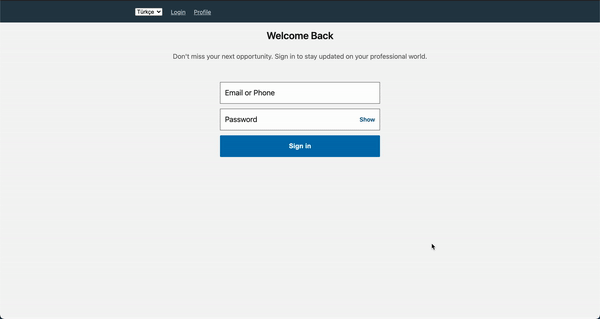

# LINKEDIN
LOGIN, PROFIL DETAIL PAGE WITH REACT and STYLED COMPONENTS



This is an application which created with
- TypeScript
- React
- Styled Components
- React Router Dom

## Installation

```bash
yarn install
```
